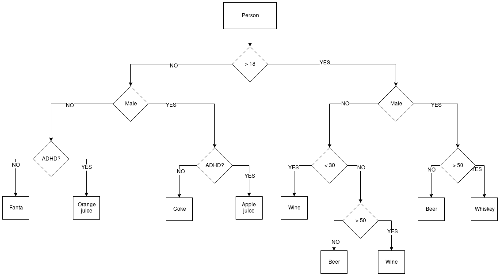

# Clean And Solid Challenge

De bartender van restaurant "De Coole Robot" heeft, je kon het al raden, een coole robot als bartender. Deze coole robot is efficient (maar sexistisch) en zet, op basis van een aantal kenmerken, in no time het juiste drankje voor je klaar.

Bij het ontwikkelen van de robot is door een businessanalyst diepgaand onderzoek gedaan en daarbij is het volgende schema ontstaan:



Tijdens een "event-storming" sessie zijn daar de volgende business objecten uit gedestileerd:

```csharp
public class Person
{
    public string FirstName { get; set; }
    public string LastName { get; set; }
    public Gender Gender { get; set; }
    public int Age { get; set; }
    public bool HasAdhd { get; set; }
}

public enum Gender
{
    Male,
    Female
}
```

# De Software 

Tijdens het ontwikkelen van de eerste versie liepen de developers al snel tegen het ["arrow head anti-pattern"](http://wiki.c2.com/?ArrowAntiPattern) aan:

```csharp
public class BarTenderService
{
    public string ServeDrink(Person person)
    {
        if (OlderThanEighteen.Satisfied(person))
        {
            if (GenderIsMale.Satisfied(person))
            {
                if (OlderThanFifty.Satisfied(person))
                {
                    return "Whiskey";
                }
                else
                {
                    return "Beer";
                }
            }
            else
            {
                if (YoungerThanThirty.Satisfied(person))
                {
                    return "Wine";
                }
                else
                {
                    if (OlderThanFifty.Satisfied(person))
                    {
                        return "Wine";
                    }
                    else
                    {
                        return "Beer";
                    }
                }
            }
        }
        else
        {
            if (GenderIsMale.Satisfied(person))
            {
                if (HasADHD.Satisfied(person))
                {
                    return "Apple juice";
                }
                else
                {
                    return "Coke";
                }
            }
            else
            {
                if (HasADHD.Satisfied(person))
                {
                    return "Orange juice";
                }
                else
                {
                    return "Fanta";
                }
            }
        }
    }
}
```

# De Challenge

De developers hadden eigenlijk geen idee hoe ze dit nu elegant en clean op zouden moeten zetten, daarbij zoveel mogelijk rekening houdend met de SOLID principles. Het leek ze leuk om een prijsvraag uit te schrijven om developers een kans te geven mee te denken in mogelijke oplossingen. 

De prijsvraag:

- Refactor bovenstaande service.

De prijs:

- De meest elegante oplossing (arbitrair!) krijgt onbeperkt, gratis en voor de rest van zijn leven gratis drank bij "De Coole Robot"!


# More info 

- ["arrow head anti-pattern"](http://wiki.c2.com/?ArrowAntiPattern) 
- https://lostechies.com/derekgreer/2009/10/05/the-arrow-anti-pattern/
- https://lostechies.com/chrismissal/2009/05/27/anti-patterns-and-worst-practices-the-arrowhead-anti-pattern/